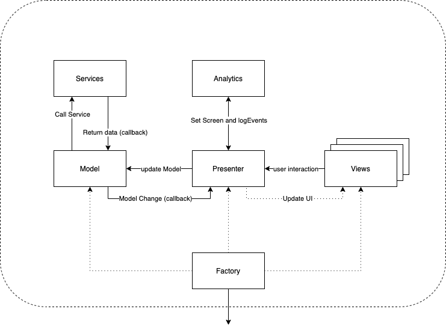

# Arquitectura MVP IOS
**Modelo–Vista–Presentador (MVP)** es una derivación del patrón arquitectónico **modelo–vista–controlador (MVC)**, y es utilizado mayoritariamente para construir interfaces de usuario.
En MVP el presentador asume la funcionalidad del "intermediario". En MVP, toda lógica de presentación es colocada al presentador.





### Descripción de patrón
MVP es un patrón arquitectónico de interfaz de usuario diseñada para facilitar pruebas de unidad automatizada y mejorar la separación de inquietudes en lógica de presentación:

- El modelo es una interfaz que define los datos que se mostrará o no actuado en la interfaz de usuario.
- El presentador actúa sobre el modelo y la vista. Recupera datos de los repositorios (el modelo), y los formatea para mostrarlos en la vista.
- La vista es una interfaz pasiva que exhibe datos (el modelo) y órdenes de usuario de las rutas (eventos) al presentador para actuar sobre los datos.
- Bonus Factory es utilizado para la inyección de dependencias. 
- Bonus 2 Analytics :)

### Instalación
```sh
$ git clone git@gitlabdevqa.ionix.aws:investigacion-y-desarrollo/mvp-demo.git
$ cd mvp-demo
$ pod install
```

